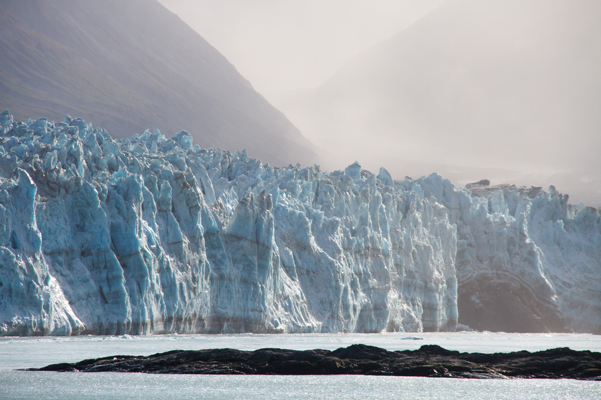
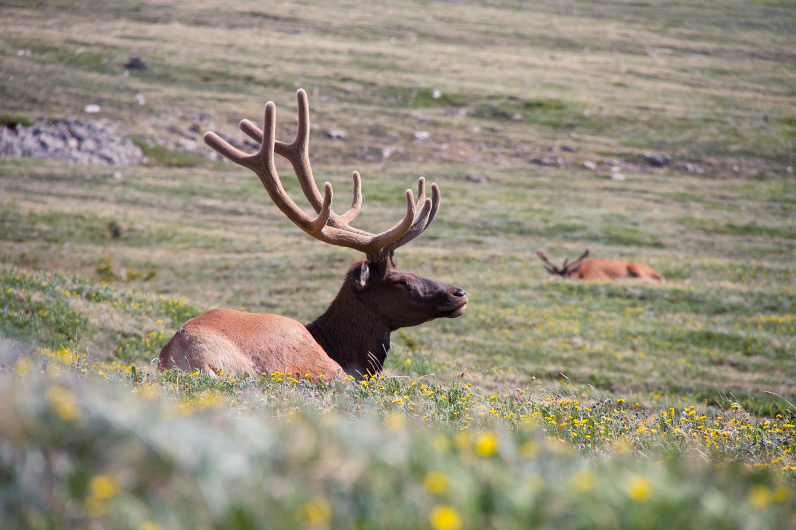

<!-- Main -->

<section id="one" class="spotlights">
	<section>
		
		

			

				<header class="major">
					<h3>Work Experience</h3>
				</header>
				
Working for a large theme park, I have integrated, developed, and maintained a variety of PowerBI dashboards for many departments, bringing insights on financials and workload labor. By providing these dashboards, senior leaders have the power to dive in through their data. 

			

		

	</section>
  <section>
		
		

			

				<header class="major">
					<h3>Education</h3>
				</header>
				
I received a B.A. in Business Administration with a concentration in Entertainment & Tourism Management. Through the want to learn more about data and how these insights can drive business decisions, I decided to further my education with a M.S. in Data Science. 

			

		

	</section>
	<section>
		
		

			

				<header class="major">
					<h3>Hobbies</h3>
				</header>
				
Although I am an analytical thinker, my creativity thrives through my love for photography, crafting, sewing, and quilting. I have a passion for traveling, with the goal to visit all 62 U.S. National Parks. I visited over 50% of them, my favorite being Glacier National Park in Montana. With my passion for photography, the photos on my portfolio are taken from my travels. 

			

		

	</section>
