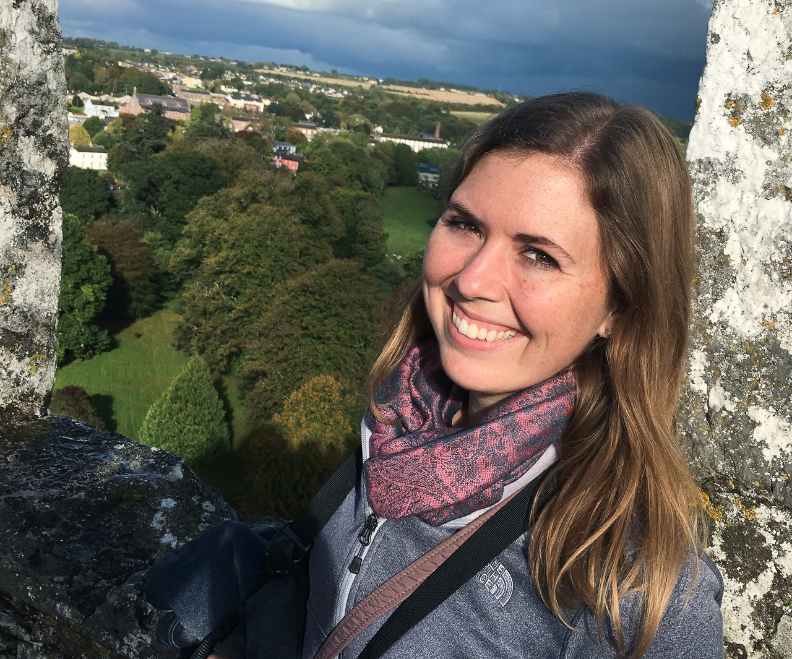
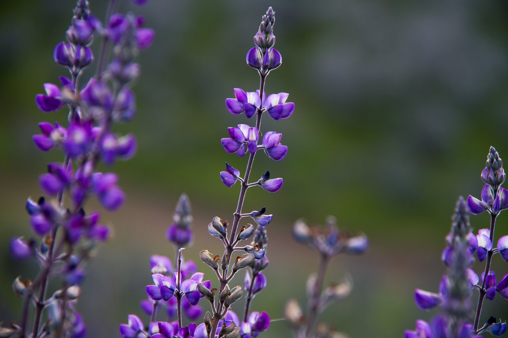

<!-- Main -->

<section id="one">
	

		<header class="major">
			<h2>Hi,</h2>
		</header>
		
Hi, my name is Torrey. I am an aspiring data scientist who is interested in machine learning and predictive analytics. I excel in data visualization, with several years’ experience of developing dashboards and reports in PowerBI. I have a strong attention to detail as well as an eye for creative design.

	

</section>

<section id="two" class="spotlights">
	<section>
		
		

			

				<header class="major">
					<h3>Work Experience</h3>
				</header>
				
Working for a large theme park, I have integrated, developed, and maintained a variety of PowerBI dashboards for many departments, bringing insights on financials and workload labor. By providing these dashboards, senior leaders have the power to dive in to their data and uncover insights they did not have access to before. 

			

		

	</section>
  <section>
		
		

			

				<header class="major">
					<h3>Education</h3>
				</header>
				
I received a B.A. in Business Administration with a concentration in Entertainment & Tourism Management. Through the want to learn more about data and how these insights can drive business decisions, I decided to further my education with a M.S. in Data Science. 

			

		

	</section>
	<section>
		
		

			

				<header class="major">
					<h3>Hobbies</h3>
				</header>
				
Although I am an analytical thinker, my creativity thrives through my love for photography, crafting, sewing, and quilting. I have a passion for traveling, with the goal to visit all 62 U.S. National Parks. I have visited over 50% of them, my favorite being Glacier National Park in Montana. Along with my passion for photography, the photos on my portfolio site are taken from my travels. 

			

		

	</section>
	<section>
		
		

			

				<header class="major">
					<h3>Skills</h3>
				</header>
				<h5>Business Intelligence:</h5>
					<UL>
					<LI>PowerBI</LI>
					</UL>
				<h5>Programming Languages:</h5>
					<UL>
					<LI>Python</LI>
					<LI>R</LI>
					</UL>
				<h5>Knowledge of:</h5>
					<UL>
					<LI>SQL</LI>
					<LI>Tableau</LI>
					</UL>
			

		

	</section>
